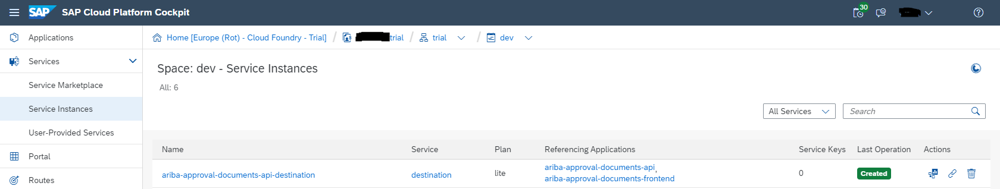

# Setup Guide

## Abstract
This document will guide you through the setup of the application including building the deployable file, 
deployment and configuration of the application so that it can be used in a demo manner.

## Business Scenario
Using SAP Conversational AI you can build intelligent chatbots. 
The chatbot can communicate with an SAP Ariba procurement system over SAP Cloud Platform to retrieve data and convert it into
chatbot expressions. 

This scenario showcases how a chatbot communicates with an SAP Ariba procurement solution over SAP Cloud Platform using 
a REST service. Based on the user input, the chatbot requests a document for approval. 
Documents can be either purchase requisition documents or invoice documents. 

This scenario can be used by a company, who wants to provide their managers an easy and intuitive way how they can
manage their approvals.

## Technical Implementation Steps

> **_Note:_**  Some of the implementation steps are dependent on other steps, that is why you will not be able to finish
>the entire implementation within one component (i.e. Chatbot) without doing implementation steps of another component 
>(i.e. SAP Cloud Platform)

## Preparation & Prerequisites
To be able to perform the implementation steps described in this document, you need to make sure that following prerequisites
have been met:

| Prerequisites                                 | Details      
|-----------------------------------------------|-------------------------------------------------------------------------------------------
| SAP API Business Hub                          | You have access to SAP API Business Hub. Alternatively, you can also make use of your own SAP Ariba procurement solution. 
| SAP Cloud Platform (Cloud Foundry)            | You have an SAP Cloud Platform account and have access to SAP Web IDE Full-Stack. For more information, refer to [SAP Cloud Platform Accounts](https://help.sap.com/viewer/65de2977205c403bbc107264b8eccf4b/Cloud/en-US/8ed4a705efa0431b910056c0acdbf377.html).     *For non-productive/testing purposes, you can use an SAP Cloud Platform trial account. Find more information on [how to get a trial account](https://developers.sap.com/tutorials/hcp-create-trial-account.html).*
| SAP Conversational AI                         | You have an SAP Conversational AI account. For more information, refer to [SAP Conversational AI](https://cai.tools.sap/).

## Step 1 - API Configuration in SAP API Business Hub
By following these steps, you will generate an authorization token that is required for the communication
between the SAP Cloud Platform application and the SAP Ariba procurement system.

### Procedure
1. Log on to the [SAP API Business Hub](https://api.sap.com/)
1. Search for *Document Approval API*
1. Choose the *Document Approval API* that was found in the **SAP Ariba APIs** package
1. Click on *Show API Key*
1. Copy and save API key for further usage
1. Copy the **Sandbox URL** by navigating to the *Details* tab. You find this value in the *Specification/Attributes* section

### Result
You have generated an authorization token for this integration scenario.

## Step 2 - Fork Chatbot in SAP Conversational AI
By following these steps, you will fork (copy) the chatbot into your SAP Conversational AI account. 
At a later stage, you will configure the chatbot to communicate with your SAP Cloud Platform application.

### Procedure
1. Log on to the [SAP Conversational AI](https://cai.tools.sap/login)
1. Navigate to the bot that was provided for this scenario by clicking [here](https://cai.tools.sap/presales-global-procurement/approvaldocumentsassistant)
1. Choose *Fork*
    > **_Note:_** You will see a dialog confirming that forking has started. Once the bot is forked, then you will receive an email.
1. After forking is completed, navigate to your account. You should see **approvaldocumentsassistant** bot in the section *Bots*.
    > **_Note:_** You can list your bots by choosing *Your bots* button in the upper right corner in SAP Conversational AI
1. The bot is now fully available in your account and can be configured. The configuration will be done at a later stage

### Result
You have forked the chatbot and can now access all the skills, intends, actions, etc..

## Step 3 - Web Client Configuration in SAP Conversational AI
By following these steps, you will create SAP Conversational AI Web Client that is embedding the chatbot into your SAP Cloud Platform application.
For further information, refer to the [SAP Conversational AI Web Client documentation](https://help.sap.com/viewer/a4522a393d2b4643812b7caadfe90c18/latest/en-US/77bb849c7f2b4648ae13ae1d212507d2.html).

### Procedure
1. In SAP Conversational AI select your bot
1. Choose *Connect* from the menu 
1. Select *SAP Conversational AI Web Client* and add new Web Client
    
1. Keep the default values for all other sections
1. Provide a name, i.e. **my-approval-documents-web-client**
1. Create the SAP Converational AI Web Client
1. Copy and save the generated Web Client script for further usage

### Result
You have created a SAP Conversational AI Web Client that will be embedded into your SAP Cloud Platform application in the next step.

## Step 4 - Application Source Code Import & Adoption in SAP Cloud Platform
In this step, you will clone (copy) the provided source code into your SAP Web IDE Full-Stack and will make make the required changes
to the source code in order to embed your chatbot into it. For further information, refer to the [SAP Web IDE documentation](https://help.sap.com/viewer/825270ffffe74d9f988a0f0066ad59f0/CF/en-US).

### Procedure
1. Logon to the SAP Web IDE Full-Stack
1. On the *Home* screen, choose **Clone from Git Repository**
    
1. Enter the URL of the provided source code repository. You can get this URL by clicking [here](https://github.com/SAP-samples/cloud-mta-ariba-approval-documents) and then click on the **Clone or download** button. Make sure you use **HTTPS** for cloning

1. Once the cloning is successful, you can access the source code in the *Development* menu
1. Open file **index.html** inside the frontend/src folder
1. Replace script-tag with your generated SAP Conversational AI Web Client script
    
1. Save your changes

### Result
You have cloned (copied) the source code into your SAP Web IDE Full-Stack and have embedded your chatbot into the application source code.

## Step 5 - Application Build & Deployment in SAP Cloud Platform
Following this step, you will create a Multi Target Application deployable file and will deploy this file into your SAP Cloud Platform account.
For further information, refer to [SAP Web IDE documentation](https://help.sap.com/viewer/825270ffffe74d9f988a0f0066ad59f0/CF/en-US/1b0a7a0938944c7fac978d4b8e23a63f.html).

### Procedure
1. In SAP Web IDE Full-Stack, from your project context menu, choose *Build > Build with Cloud MTA Build Tool*
    
1. Once the build process is done, the directory **mta_archives** is created where the deployable file of type **.mtar** is included
1. Deploy this file by right clicking on it and choose *Deploy > Deploy to SAP Cloud Platform*
    
1. Specify your SAP Cloud Platform account details in the deployment popup. For further information, refer to the [SAP Web IDE Deploy Applications documentation](https://help.sap.com/viewer/825270ffffe74d9f988a0f0066ad59f0/CF/en-US/463b52bd34de4549ad05f6282ada02d6.html).
    

### Result
You have successfully deployed the application into your SAP Cloud Platform account.

## Step 6 - Application Configuration in SAP Cloud Platform
In this step, you will configure your deployed application to communicate with your SAP Ariba procurement system.
For more information, refer to [SAP Cloud Platform Create HTTP Destinations](https://help.sap.com/viewer/cca91383641e40ffbe03bdc78f00f681/Cloud/en-US/1e110da0ddd8453aaf5aed2485d84f25.html).

### Procedure
1. Log on to your *SAP Cloud Platform account*
1. Navigate to your *SAP Cloud Platform Cloud Foundry Space* in which you have deployed the application into
1. From the left menu, choose *Services > Service Instances*
1. Select the **destination** service instance that your deployed application is bound to by clicking on its *Name*
    
1. Choose *Destinations* from the left menu

#### Procedure - Create Backend Destination

1. Create destination by clicking on *New Destination* and enter the following details
   * Name: ariba-approval-documents-api
   * Type: HTTP
   * Description: Manage approval document backend
   * URL: << enter your ariba-approval-document-api application URL here >>
   * Proxy Type: Internet
   * Authentication: NoAuthentication
   
   Add a new property:
   * forwardAuthToken: true
   
   
   
1. Save destination

#### Procedure - Create SAP Ariba procurement system Destination

1. Create another destination with the following details
    * Name: ariba-approval-documents-sandbox
    * Type: HTTP
    * Description: SAP Ariba procurement sandbox system
    * URL: << Sandbox URL that you have saved in Step 1 (https://sandbox.api.sap.com/ariba/api/approval/v1/sandbox/) >>
    * Proxy Type: Internet
    * Authentication: NoAuthentication
    
    Add a new property:
    * APIKey: << your API key created in Step 1 >>
1. Save destination

#### Procedure - Obtain OAuth2 Information
1. Navigate to the Service Instances (see Step 6)
1. Select the **xsuaa** service that your deployed application is bound to by clicking on its *Name*
1. Click button *Show sensitive data*
    
1. Copy and save the values for **url**, **clientid** and **clientsecret** for further usage.
    > **_Note:_** As this information is highly sensitive, do not share this with others.

## Result
You have entered all the integration details, this means:
* Your frontend application is connected to your backend application
* Your backend application is connected to your SAP Ariba procurement system

## Step 7 - Communication Configuration in SAP Conversational AI
In this last step, you are connecting the chatbot to the deployed backend application running in your SAP Cloud Platform account.

### Procedure - Change Connection Details
1. Log on to the [SAP Conversational AI](https://cai.tools.sap/login)
1. Select your bot, choose *Build* and select **approvaldocuments**
    
1. Choose *Actions* and scroll to the **API Service Configuration** section
1. Enter the following details in the *Authentication* tab
    * URL: << your ariba-approval-document-api application URL with appendix **/ariba** >> 
    * Authentication Type: OAuth2 Authentication
    * Client ID: << your client id from step 6 >>
    * Client Secret: << your client secret from step 6 >>
    * Authorization URL: << your url from step 6 with appendix **/oauth/token** >>
    
    
1. Choose *Headers* and enter the following details
    * Content-Type: application/json
    
1. Choose *Body* and enter the following details

    `{
         "type": "{{memory.type.raw}}"
     }`

    

1. Save the configuration

### Procedure - Change Chatbot response
1. In the *Actions* menu, scroll to the section **invoices**. This section is having the following condition
    
1. Change the image source to << your ariba-approval-document-frontend application URL with appendix **/resources/img/invoices_image.jpg** >>
    
1. Save

1. Scroll to the section **requisitions**. This section is having the following condition
    
1. Change the image source to << your ariba-approval-document-frontend application URL with appendix **/resources/img/requisitions_image.png** >>
    
1. Save

### Result
You have created a connection between your chatbot and your SAP Cloud Platform application and you have
adjusted the response of your chatbot.

## Testing the scenario
As all implementation steps are done, you can now test your application and your chat bot.

### Purpose
You will test the scenario end to end by having a conversation to the chatbot and seeing the results.

### Prerequisites
None

### Procedure
1. Access your ariba-approval-document-frontend application which is deployed on your SAP Cloud Platform account
1. Log on to your application
1. Access chatbot on right-bottom corner
1. You can now start a dialog with the bot. The following images shows some sample dialogs

